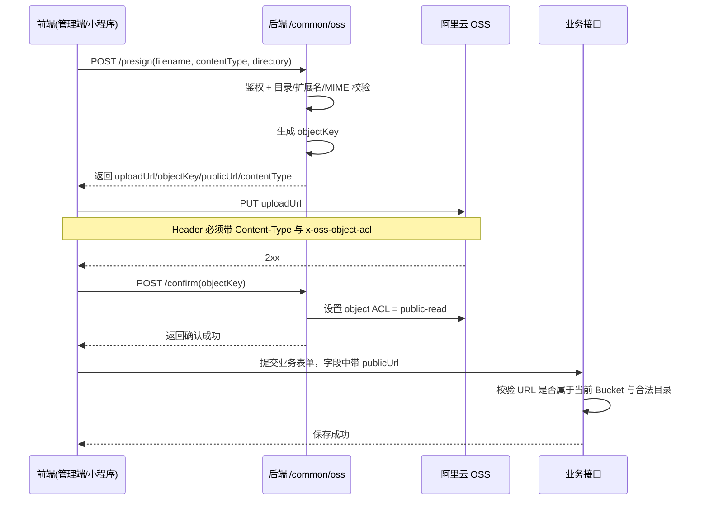

# 前后端 OSS 签名上传流程梳理

## 1. 结论

- 当前项目采用的是“后端签发预签名 URL，前端直传 OSS，业务接口只保存 OSS 公网 URL”的模式。
- 管理端和小程序共用同一套后端接口：
  - `POST /common/oss/presign`
  - `POST /common/oss/confirm`
- 业务接口不会接受任意文件外链，只接受当前 OSS Bucket 下、目录合法、扩展名合法的 HTTPS URL。
- 服务端自己生成的文件（例如切题裁图、资料预览图）不走这套预签名流程，而是后端直接上传。

## 2. 参与方

- 前端：
  - 管理端：`admin/src/app/api/oss.ts`
  - 小程序：`minigram/miniprogram/utils/oss-upload.ts`
- 后端：
  - 路由：`backend/api/common/oss.py`
  - 上传规则：`backend/libs/upload_rules.py`
  - OSS 基础能力：`backend/libs/oss.py`
- 对象存储：
  - 阿里云 OSS

## 3. 标准时序



## 4. 后端签名接口流程

### 4.1 `/common/oss/presign`

请求体：

```json
{
  "filename": "logo.png",
  "contentType": "image/png",
  "directory": "school"
}
```

后端处理步骤：

1. 校验登录态，未登录直接拒绝。
2. 游客身份禁止上传。
3. 调用 `validate_upload_request()` 校验：
   - 上传目录是否在白名单中
   - 文件扩展名是否匹配该目录
   - `contentType` 是否匹配该目录
   - 如果前端传的是空值或 `application/octet-stream`，后端会按扩展名回填默认 MIME
4. 调用 `build_upload_object_key()` 生成对象 Key：
   - 格式：`{directory}/{uuid}.{extension}`
5. 调用 OSS SDK 的 `sign_url("PUT", ...)` 生成 600 秒有效期的预签名上传地址。
6. 返回：
   - `objectKey`
   - `uploadUrl`
   - `publicUrl`
   - `contentType`

返回示例：

```json
{
  "objectKey": "school/1d8b7a2d6a6b4d4a9c66c2cc6c7d5a3f.png",
  "uploadUrl": "https://...",
  "publicUrl": "https://bucket.oss-region.aliyuncs.com/school/1d8b7a2d6a6b4d4a9c66c2cc6c7d5a3f.png",
  "contentType": "image/png"
}
```

### 4.2 前端直传 OSS

前端拿到 `uploadUrl` 后，直接向 OSS 发 `PUT` 请求：

- 必须使用后端返回的 `contentType`
- 需要带上 `x-oss-object-acl: public-read`
- 请求体直接是文件二进制内容

### 4.3 `/common/oss/confirm`

请求体：

```json
{
  "objectKey": "school/1d8b7a2d6a6b4d4a9c66c2cc6c7d5a3f.png"
}
```

后端处理步骤：

1. 再次校验登录态。
2. 调用 `validate_object_key_directory()` 校验 `objectKey` 是否属于合法目录前缀。
3. 调用 `bucket.put_object_acl(object_key, public-read)` 显式设置对象可公开读取。
4. 返回确认成功。

说明：

- 从现有实现看，前端在直传阶段已经带了 `x-oss-object-acl: public-read`，`/confirm` 又重复设置一次 ACL。
- 这意味着 `confirm` 更像是“后端兜底确认步骤”，当前协议下不建议省略。

## 5. 上传目录与文件规则

当前后端白名单目录定义如下：

| 目录                    | 允许扩展名          | 用途         |
| ----------------------- | ------------------- | ------------ |
| `avatars`               | `jpg/jpeg/png/webp` | 用户头像     |
| `mistake-batches`       | `jpg/jpeg/png/webp` | 错题批次图片 |
| `weekly-comments`       | `jpg/jpeg/png/webp` | 周评语图片   |
| `school`                | `jpg/jpeg/png/webp` | 学校 Logo    |
| `consultation`          | `jpg/jpeg/png/webp` | 咨询配图     |
| `banners`               | `jpg/jpeg/png/webp` | Banner 配图  |
| `materials`             | `pdf/doc/docx`      | 真题资料文件 |
| `exam-papers`           | `jpg/jpeg/png/webp` | 试卷图片     |
| `exam-papers/pdf`       | `pdf`               | 试卷 PDF     |
| `exam-papers/questions` | `jpg/jpeg/png/webp` | 题目裁图     |

补充说明：

- 对象 Key 的目录前缀是后端控制上传范围的第一道约束。
- 业务接口保存 URL 时，还会再次根据业务字段限制允许目录，例如头像只能是 `avatars`，学校 Logo 只能是 `school`。

## 6. 管理端实现

核心入口：`admin/src/app/api/oss.ts`

处理步骤：

1. `validateFileForDirectory()` 先在前端做一层目录与文件类型匹配校验。
2. 调用 `/common/oss/presign` 获取签名结果。
3. 用浏览器 `fetch` 直接对 `uploadUrl` 发 `PUT` 请求。
4. 上传成功后调用 `/common/oss/confirm`。
5. 返回 `publicUrl` 给页面，由页面再提交给业务接口。

当前典型使用点：

- 学校 Logo 上传：`admin/src/app/pages/SchoolInfo.tsx`
- 试卷图片上传：`admin/src/app/pages/ExamPapers.tsx`

说明：

- 管理端目前上传试卷 PDF 时，不是把 PDF 直接传到 `exam-papers/pdf`，而是先把 PDF 渲染成图片页，再逐页上传到 `exam-papers`。

## 7. 小程序实现

核心入口：`minigram/miniprogram/utils/oss-upload.ts`

处理步骤：

1. `shouldUploadToOss()` 先判断当前路径是否还是本地临时文件。
2. 调用 `/common/oss/presign` 获取签名结果。
3. 通过 `wx.request` 发 `PUT` 请求，把本地文件字节流直接上传到 OSS。
4. 上传成功后调用 `/common/oss/confirm`。
5. 返回 `publicUrl` 给页面，再由页面调用业务接口保存。

当前典型使用点：

- 头像上传：`pages/profile/index.ts`
- 错题批次图片上传：`pages/teacher-collect/index.ts`
- 周评语图片上传：`pages/teacher-collect/index.ts`

说明：

- 小程序源码顶部注释曾写成“`wx.uploadFile` 直传 OSS”，但当前实际实现是 `wx.request + PUT + readFileSync`。
- 如果页面里已经拿到的是线上 URL，且不是本地临时路径，小程序可以跳过重新上传。

## 8. 业务接口如何接收上传结果

签名上传只负责把文件送进 OSS，真正入库发生在后续业务接口。

典型模式：

1. 前端先拿到 `publicUrl`
2. 再把该 URL 作为业务字段提交
3. 后端业务 ViewModel 调用 `validate_oss_url()` 或 `validate_oss_url_list()` 做二次校验
4. 校验通过后才写库

典型例子：

- 头像只能来自 `avatars`
- 学校 Logo 只能来自 `school`
- 错题照片只能来自 `mistake-batches`
- 周评语图片只能来自 `weekly-comments`
- 试卷图片只能来自 `exam-papers`

这层校验会同时验证：

- 必须是 `https`
- 必须属于当前配置的 OSS Bucket Host
- 必须落在允许的目录前缀下
- 扩展名必须符合该业务字段要求

因此，业务接口层面对“外链图片”“其他 Bucket 文件”“目录串用”都有拦截能力。

## 9. 与后端直传流程的区别

下面这些不是前端签名上传，而是后端自己直接上传：

- 资料预览 PDF / 试读图生成后上传
- 试卷切题后的题目裁图上传
- PDF 内嵌图片抽取后上传

它们统一走 `upload_bytes_to_oss()`：

- 后端直接使用 AK/SK 构建 `Bucket`
- 直接 `put_object`
- 直接返回公网 URL

所以项目里实际存在两条 OSS 上传链路：

1. 前端文件上传：预签名 URL + 前端直传
2. 服务端产物上传：后端直接上传

## 10. 对接与排查 Checklist

- 前端调用 `/common/oss/presign` 时，`directory` 必须命中白名单。
- 前端上传时必须使用后端返回的 `contentType`。
- 前端上传时必须带 `x-oss-object-acl: public-read`。
- 前端上传成功后不要跳过 `/common/oss/confirm`。
- 业务接口保存的是 `publicUrl`，不是 `uploadUrl`，也不是本地路径。
- 业务字段目录要和上传目录一致，不能把 `school` 目录文件拿去当头像。
- 若业务接口报“文件必须上传到当前 OSS 存储”或“目录不合法”，优先检查 URL 来源、Bucket Host、目录前缀是否匹配。
